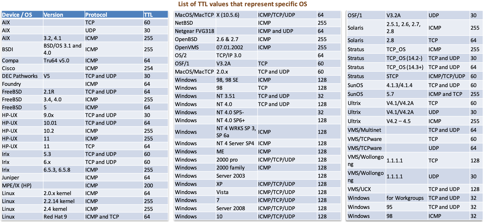

- [Module 06 - Network PenTest - Internal](#module-06---network-pentest---internal)
  - [Footprinting](#footprinting)
    - [Identify internal domains](#identify-internal-domains)
    - [Identify Hosts](#identify-hosts)
    - [Identify Internal IP Range of Subnet](#identify-internal-ip-range-of-subnet)
  - [Network Scanning](#network-scanning)
    - [Scanning Methodology](#scanning-methodology)
    - [Scan a Network: IP Addresses, Multiple Addresses, Subnet Scan](#scan-a-network-ip-addresses-multiple-addresses-subnet-scan)
    - [Scan a Network: Live Host Scan](#scan-a-network-live-host-scan)
    - [Scan a Network: Port Scan](#scan-a-network-port-scan)
    - [Common port list](#common-port-list)
    - [Using Metasploit as a scanner](#using-metasploit-as-a-scanner)
      - [Prepare Database](#prepare-database)
      - [Metasploit Database Commands](#metasploit-database-commands)
      - [Managing Workspaces](#managing-workspaces)
      - [Gathering Data](#gathering-data)
      - [Store and Review the Results](#store-and-review-the-results)
      - [Setting Up Modules](#setting-up-modules)
  - [OS and Service Fingerprinting](#os-and-service-fingerprinting)
    - [Using TTL](#using-ttl)
    - [Identify the OS](#identify-the-os)
      - [Manual Banner Grabbing](#manual-banner-grabbing)
    - [Identify the Services](#identify-the-services)
    - [Map the Internal Network](#map-the-internal-network)
  - [Enumeration](#enumeration)
    - [Perform Service Enumeration](#perform-service-enumeration)
    - [Enumeration Techniques and Tools](#enumeration-techniques-and-tools)
    - [Perform NetBIOS Enumeration](#perform-netbios-enumeration)
    - [Perform SNMP Enumeration](#perform-snmp-enumeration)
    - [Perform LDAP Enumeration](#perform-ldap-enumeration)
    - [Perform NTP Enumeration](#perform-ntp-enumeration)
    - [Perform SMTP Enumeration](#perform-smtp-enumeration)
    - [Perform IPSec Enumeration](#perform-ipsec-enumeration)
    - [Perform VoIP Enumeration](#perform-voip-enumeration)
    - [Perform SMB Enumeration](#perform-smb-enumeration)
    - [Perform RPC Enumeration](#perform-rpc-enumeration)
    - [Perform Null Session Enumeration](#perform-null-session-enumeration)
    - [Perform Unix/Linux Enumeration](#perform-unixlinux-enumeration)
    - [Perform IPv6 Enumeration](#perform-ipv6-enumeration)
    - [Sniff the Network](#sniff-the-network)
    - [Capturing data with Tcpdump](#capturing-data-with-tcpdump)
  - [Vulnerability Assessment](#vulnerability-assessment)
    - [Perform Internal Vulnerability Assessment](#perform-internal-vulnerability-assessment)
      - [Nessus](#nessus)
      - [OpenVas](#openvas)
    - [Perform Network Vulnerability Scanning Using Network Vulnerability Scanners](#perform-network-vulnerability-scanning-using-network-vulnerability-scanners)
    - [Perform Vulnerability Scan Using Nmap](#perform-vulnerability-scan-using-nmap)
    - [Vulnerability Assessment Report](#vulnerability-assessment-report)
    - [Map the Service Version with the Associated Security Vulnerabilities](#map-the-service-version-with-the-associated-security-vulnerabilities)
    - [Map the Windows Applications with the Exploits](#map-the-windows-applications-with-the-exploits)
    - [Map the Windows OS with the Associated Vulnerabilities](#map-the-windows-os-with-the-associated-vulnerabilities)
    - [Map the Solaris with the Associated Security Vulnerabilities](#map-the-solaris-with-the-associated-security-vulnerabilities)
    - [Map the Unix/Linux with the Associated Security Vulnerabilities](#map-the-unixlinux-with-the-associated-security-vulnerabilities)
    - [Vulnerability Scan Analysis Process. Summary](#vulnerability-scan-analysis-process-summary)
  - [Windows Exploitation](#windows-exploitation)
    - [Exploitation](#exploitation)
    - [Exploiting targets](#exploiting-targets)
    - [Finding exploits](#finding-exploits)
  - [Unix/Linux Exploitation](#unixlinux-exploitation)
  - [Other Internal Network Exploitation Techniques](#other-internal-network-exploitation-techniques)
  - [Automating Internal Network PenTest Effort](#automating-internal-network-pentest-effort)
  - [Post Exploitation](#post-exploitation)
  - [Advanced Tips and Techniques](#advanced-tips-and-techniques)
  - [Document the Result](#document-the-result)
- [Footnotes](#footnotes)

# Module 06 - Network PenTest - Internal
An internal penetration testing highlights the following items:
- protocol and network infrastructure vulnerabilities
- server operating system and application vulnerabilities
- internal controls and procedures
- unsuitable user privileges
- internal "intrawalls" separating subnetworks

## Footprinting
Purpose: to gather internal information like domains, hosts, subnets, IP ranges, etc.

### Identify internal domains
Preferred tools: net

| Command | Description |
| --- | --- |
| `net view` | display a list of computers in current domain |
| `net view /domain` | list domains in the network |
| `net view \\ComputerName` | list of file/printer shares |
| `net view \\ComputerName /all` | displays the shares including hidden ones |
| `net view /network:nw` | lists the list of shares on a remote Netware computer |

### Identify Hosts
| Command | Description |
| --- | --- |
| `systeminfo \| findstr /B /C:"Domain"\` | find the domain name |
| `echo %userdomain%` | logged in user's domain |
| `wmic <computer_system> get domain` | find domain name |
| `net view /domain: [domain name]` | available servers on \<domain name\> |

### Identify Internal IP Range of Subnet
| Command | Description |
| --- | --- |
| `ipconfig` | host's IP address and subnet mask |
| `arp -a` | IP and physical addresses on same segment |
| `nmap -sL <IP_RANGE>` | list IP addressess in a target subnet |

**Other tools**
- [SoftPerfect Network Scanner](https://www.softperfect.com/products/networkscanner/), IP, NETBIOS and SNMP scanner. Can mount shared folders. `Options > IP Address > Detect Local IP Range` calculates the network IP range.
- [MyLanViewer](https://www.mylanviewer.com/network-ip-scanner.html), includes NETBIOS, IP scanning, Wake-On-Lan manager and remote shutdown.
- [SolarWind's IP Network Browser](https://www.solarwinds.com/network-performance-monitor/use-cases/ip-network-browser)

## Network Scanning
Preferred tools: nmap
Purpose: to discover exploitable communication channels, probe as many listeners as possible and keep track of the ones that are responsive or useful to our needs.

### Scanning Methodology
1. Live systems, `-sP`, `-sn` in nmap
2. Ports, all of them, 0-65535. `-sS`, `-sT`, `-sU` in nmap
3. Services, what's behind the ports. `-sV` in nmap
4. Enumeration, `-sC`, `-A` in nmap
5. Identify vulnerabilities, manual search and tools ([Search and Map the Target](./cpent%20-%20module%2005.md#search-and-map-the-target), [Vulnerability Assessment](cpent%20-%20module%2006.md#vulnerability-assessment))
6. Exploit, validate the vulnerability and exploit it ([Exploit Verification](./cpent%20-%20module%2005.md#exploit-verification))

### Scan a Network: IP Addresses, Multiple Addresses, Subnet Scan
| Scan Type | Command |
| --- | --- |
| Scan single host | `nmap <IP_ADDRESS>` |
| Scan multiple hosts | `nmap <IP1> <IP2> <IP3>...` or `nmap 10.10.10.10,11,12,13...` |
| Scan a subnet | `nmap <CIDR>`, e.g. `nmap 192.168.0.0/24` |
| Scan IP address range | `nmap 10.10.10.10-255` |
| Scan host(s) from file | `nmap -iL <input_file>` |
| Save results to file | `nmap <IP_ADDRESS> > <output_file>` |
| Quick scan | `nmap -F <IP_ADDRESS>` |
| Scan alive hosts | `nmap -sn <IP_RANGE>` [^1]|

Other tools:
- [Angry IP Scanner](https://angryip.org/)
- [SoftPerfect Network Scanner](https://www.softperfect.com/products/networkscanner/)

### Scan a Network: Live Host Scan
Preferred tools: nmap, netdiscover

- `nmap`
- [Netdiscover](https://kalilinuxtutorials.com/netdiscover-scan-live-hosts-network/). Works in **active** (default) or **passive** (`-p`) mode. A range can be specified (`-r <CIDR>`). In passive mode nmap can be used to ping hosts and get traffic (e.g. `nmap -sn <CIDR>`).
- [Ettercap](https://linux.die.net/man/8/ettercap), excellent for MitM. Sniff only our connections `ettercap -T -i eth0 -q -p`.
- Bash script, that checks if a host is alive (`hostcheck.sh`)
```bash
#!/bin/bash
host=$1
function pingcheck {
ping=`ping -c 1 $host | grep bytes | wc -l`
if [ "$ping" -gt 1 ];
then
echo "$host is up";
else
echo "$host is down. Quitting";
exit
fi
}
pingcheck
```
- Ruby ping sweep (`pingsweep.rb`)
```ruby
#!/usr/bin/ruby
require 'socket'
s = UDPSocket.new
254.times do |i|
  next if i == 0
  s.send("test", 0, "192.168.0."+i.to_s, 53)
end
f = File.open("/proc/net/arp", "r")
data = f.read.split("\n")
up_hosts = []
data.each do |line|
  entry = line.split(/\s+/)
  next if entry[3] == "00:00:00:00:00:00"
  next if entry[0] == "IP"
  up_hosts << {:ip => entry[0], :mac => entry[3]}
end
print "Active network hosts\n"
print "%-12s\t%s\n" % ["IP Addr", "MAC Address"]
up_hosts.each do |host|
  print "%-12s\t%s\n" % [host[:ip], host[:mac]]
end
```
- Nmap host discovery, great for scanning, not for global nets.
  - Use ARP on local subnets (`nmap -PR 192.168.0.0/24`)
  - ICMP usually blocked
  - Use TCP host discovery (`nmap 192.168.0.0/24 -sn -PA80`)
- [Unicornscan](https://linuxhint.com/unicornscan_beginner_tutorial/), fast scanner that can set the rate and packets per second.
- Use scripts
```python
import socket
s = socket.socket(socket.AF_INET, socket.SOCK_STREAM)
s.connect(("www.google.com",80))
s.send("GET / HTTP/1.1\nHost: www.google.com\n\n".encode("ascii"))
page = ""
while 1:
    data = s.recv(1024).decode("ascii")
    if data == "":
        break
    page = page + data
```
- Source port scanning, to attempt pass through filtering devices. Some stateless devices filter most origin ports but leave some others open (e.g. SSH, FTP, DNS, HTTP/S). It's worth to try this technique when attempting to trespass it.
  - `nmap -g`
  - `netcat -p`
  - `msfconsole`, `set CPORT`
- [Zmap](https://github.com/zmap/zmap/wiki) to scan a big amount of IPv4 space.
- [MASSCAN](https://github.com/robertdavidgraham/masscan), let's scan the Internet!

### Scan a Network: Port Scan
Preferred tools: nmap

| Scan Type | Command |
| --- | --- |
| Scan a port | `nmap -p [PORT] <IP_ADDRESS>` |
| Scan multiple ports | `nmap -p [PORT1],[PORT2] <IP_ADDRESS>` |
| Scan ALL ports | `nmap -p- <IP_ADDRESS>` [^2] |
| Scan port range | `nmap -p [PORT1-PORT2] <IP_ADDRESS>` |
| Scan most common ports | `nmap --top-ports [NUMBER] <IP_ADDRESS>` |
| Scan specific TCP ports | `nmap -p T:[PORT] <IP_ADDRESS>` |
| Scan all TCP ports | `nmap -sT <IP_ADDRESS>` |
| Scan specific UDP ports | `nmap -p U:[PORT] <IP_ADDRESS>` |
| Scan all UDP ports | `nmap -sU <IP_ADDRESS>` |
| Display only open ports | `nmap --open <IP_ADDRESS>` |

Ports can be in any of the following states:
- **open**, actively responds to an incoming connection
- **closed**, the port responds but doesn't seem to have any service running. Found where there are no firewalls or filtering devices
- **filtered**, ports protected by a firewall or filtering device and nmap can't know if it's open or closed
- **unfiltered**, nmap can access but doesn't know if it's open or closed
- **open|filtered**, nmap thinks it's open or filtered but can't assure the actual state
- **closed|filtered**, nmap thinks it's closed or filtered but can't assure the actual state

### Common port list
| Port Number | Service |
|--- | --- |
| 7 | Echo |
| 20-21 | FTP |
| 22 | SSH/SCP |
| 23 | Telnet |
| 25 | SMTP |
| 43 | WHOIS |
| 53 | DNS |
| 69 | TFTP |
| 79 | Finger |
| 80 | HTTP |
| 88 | Kerberos |
| 109 | POP2 |
| 110 | POP3 |
| 115 | Simple File Transfer Protocol (SFTP) |
| 118 | SQL Services |
| 123 | NTP |
| 135 | MS RPC |
| 137-139 | NetBIOS |
| 143 | IMAP4 |
| 156 | SSQL server |
| 161-162 | SNMP |
| 194 | IRC |
| 443 | HTTP over SSL |
| 464 | Kerberos |
| 465 | SMTP over SSL |
| 512 | rexec |
| 513 | rlogin |
| 514 | syslog |
| 587 | SMTP |
| 631 | Internet Printing |
| 660 | Mac OSX Server |
| 691 | MS Exchange |
| 749-752 | Kerberos |
| 843 | Adobe Flash |
| 873 | rsync |
| 902 | VMware Server |
| 989-990 | FTP OVER SSL |
| 993 | IMAP4 OVER SSL |
| 995 | POP3 OVER SSL |

### Using Metasploit as a scanner
Metasploit can scan networks or can import results from nmap. This is useful to improve our hosts DB.

We can obtain help on Metasploit commands either by executing `help [command]` or `[command] -h`.

#### Prepare Database
| Command | Description |
| --- | --- |
| `systemctl start postgresql` | Start the database |
| `msfdb init` | Initializes the DB |
| `msfdb status` | Checks if connected |

#### Metasploit Database Commands
All commands to be executed within `msfconsole`.

| Command | Description |
| --- | --- |
| `db_connect` | To interact with other DBs than the default one |
| `db_export` | Exports the DB to create reports or as input to another tool |
| `db_nmap` | Executes `nmap` and stores the result in Metasploit's DB |
| `db_status` | Checks DB connection |
| `db_import` | Imports scan results from `nmap`, `nessus`, etc. Requires an XML formatted scan output |

#### Managing Workspaces
Workspaces gives us the ability to save scan results per subnet/location/networks. All commands executed within `msfconsole`.

| Command | Description |
| --- | --- |
| `help workspace` | Prints `workspace`'s command help |
| `workspace -a [NANE]` | Creates \[NAME\] workspace and activates it |
| `workspace [NAME]` | Activates \[NAME\] workspace |
| `workspace -d [NAME]` | Deletes \[NAME\] workspace |

#### Gathering Data
| Command | Description |
| --- | --- |
| `db_nmap` | Executes `nmap` and stores the result in Metasploit's DB |
| `db_import` | Imports scan results from `nmap`, `nessus`, etc. Requires an XML formatted scan output |

#### Store and Review the Results
| Command | Description |
| --- | --- |
| `hosts -h` | Displays help for the `hosts` command |
| `hosts` | Displays target information |
| `db_export` | Exports the DB (as XML or pwdump) to create reports or as input to another tool |

#### Setting Up Modules
We can leverage the data in the DB to set up module's configurations.

For example, to leverage the hosts found to make a TCP scan:
```
msf 6 > use auxiliary/scanner/portscan/tcp # using the TCP scanner
msf 6 > hosts -c address -R  # -R imports the target data into the module
msf 6 > run  # executes the scan and stores results in the database
```

## OS and Service Fingerprinting
Preferred tools: nmap, ping, wireshark, p0f
Identifying the operating system running the target host.

### Using TTL
This is a quick (but not reliable) way to identify an OS running on a target host. Different OSs use different TTLs. We can use `ping`, `wireshark`, etc and look for the TTL value to determine the OS.

**Sample of TTL values**


### Identify the OS
We can use `p0f` as one of its outputs is the OS being used:

```
$ sudo p0f -i any -p -o /tmp/sniff.log
...
.-[ 1.2.3.4/1524 -> 4.3.2.1/80 (syn) ]-
|
| client   = 1.2.3.4
| os       = Windows XP
| dist     = 8
| params   = none
| raw_sig  = 4:120+8:0:1452:65535,0:mss,nop,nop,sok:df,id+:0
|
`----
...
```

We can also use `nmap`.

| Scan Type | Command |
| --- | --- |
| Identify OS on targer machine | `nmap -O <IP_ADDRESS>` |
| Enables OS version detection | `nmap -sV -O -v <IP_ADDRESS>` |
| OS detection + script run | `nmap -A -T4 -v <IP_ADDRESS>` |
| Limits OS detection to promising targets | `nmap -O -Pn --osscan-limit <IP_RANGE>` |
| Aggressively guess OS detection | `--osscan-guess` or equivalent `--fuzzy` |
| Set maximum number of retries (default 5) to guess the OS | `--max-os-tries [NUMBER]` |
| SMB OS discovery | `nmap --script smb-os-discovery.nse --script-args=unsafe=1 -p 445 <IP_ADDRESS>` |

#### Manual Banner Grabbing
Connecting manually to the port and observe the response.

**Netcat or Telnet**
```bash
$ nc -vn <IP_ADDRESS> <PORT>
<SERVICE BANNER>
```

**Using dmitry**
```bash
$ dmitry -pb <IP_ADDRESS>
...
<SERVICE BANNER>
```

**Using Python**
```python
#!/usr/bin/env python
import socket
import sys
host=sys.argv[1]
ua="Mozilla/5.0"
bangrab = socket.socket(socket.AF_INET, socket.SOCK_STREAM)
bangrab.connect((host, 80))
data = "HEAD / HTTP/1.1\r\nHost: {}\r\nUser-Agent: {}\r\n\r\n".format(host,ua).encode('ascii')
bangrab.send(data)
r = bangrab.recv(500)
print(r.decode('ascii'))
bangrab.close()
```

**Using Ruby**
```ruby
#!/usr/bin/env ruby
require 'socket'
host=ARGV[0]
ua="Mozilla/5.0"
data="HEAD / HTTP/1.1\r\nHost:#{host}\r\nUser-Agent:#{ua}\r\n\r\n"
a=TCPSocket.open(host, 80)
a.puts(data)
puts a.recv(500)
a.close
```
### Identify the Services
Preferred tools: nmap, svmap, Metasploit

| Scan Type | Command |
|--- | --- |
| Identify services | `nmap -sV <IP_ADDRESS>` |
| Services running on open ports | `nmap -T4 -A -v <IP_ADDRESS>` |
| Identify IPSec devices | `nmap -sU -p 500 <IP_ADDRESS>` |
| Identify VoIP devices | `svmap <IP_RANGE>` |
| SSH fingerprinting | Metasploit. Run `search ssh_version` and then use a found module. |

| Metasploit Instruction | Command |
| --- | --- |
| Display service details from the DB | `services` |
| Display services data | `services -c port,proto,created_at <IP_ADDRESS>` |
| Services Port State | `services -c port,proto,state -p 1-300` |

### Map the Internal Network
Mapping the internal network is very useful. Tools you can use:
- [Network Topology Mapper](https://www.solarwinds.com/network-topology-mapper)
- [NetSurveyor](https://nutsaboutnets.com/archives/netsurveyor-wifi-scanner/)

## Enumeration
The process of extracting as much useful data as possible (usernames, IP tables, macine names, DNS details, services running, etc.) from a system or network. This will allow us to identify system attack points and perform password attacks to gain unauthorized access to systems.

### Perform Service Enumeration
- [SuperScan](https://www.softpedia.com/get/Network-Tools/Network-IP-Scanner/SuperScan.shtml), multi-functional application designed as a TCP port scanner, pinger and address resolver. Performs ping sweeps, Windows Enumeration, Host and Service discovery, etc.
- [Winfingerprint](https://www.softpedia.com/get/Security/Security-Related/winfingerprint.shtml), enables security administrators to scan a range of IP addresses and retrieve useful information on the remote hosts, such as patch level. WinFingerprint is able to send the Ping and Traceroute signals to the hosts, show an event log and errors, and more. Results include the computer name, Ping reply time, SID, MAC address, patch level, NetBIOS shares, and services.

### Enumeration Techniques and Tools
| Technique | Information Obtained | Tools |
| --- | --- | --- |
| NetBIOS enumeration | <ul><li>list of computers</li><li>list of shares</li><li>policies and passwords</li></ul> | <ul><li>nbtstat</li><li>SuperScan</li><li>Hyena</li><li>Winfingerprint</li></ul> |
| SNMP enumeration | <ul><li>Information about network resources such as hosts, routers, devices, and shares</li></ul> | <ul><li>OpUtils</li><li>Engineer's Toolset</li><li>SNMP Scanner</li></ul> |
| LDAP enumeration | <ul><li>Valid user names, addresses, departmental details, and so on</li></ul> | <ul><li>Softerra LDAP Administrator</li><li>LDAP Admin Tool</li></ul> |
| NTP enumeration | <ul><li>List of hosts connected to NTP server</li><li>Clients IP addresses in a network, and their system names and OSs</li><li>Internal IPs can also be obtained if the NTP server is in the DMZ</li></ul> | <ul><li>NTP Server Scanner</li><li>nmap</li><li>Wireshark</li></ul> |
| SMTP enumeration | <ul><li>List of valid users on the SMTP server</li></ul> | <ul><li>NetScanTools Pro</li></ul> |
| IPSEC enumeration | <ul><li>Encryption and hashing algorithm, authentication type, key distribution algorithm, and so on</li></ul> | <ul><li>Ike Scan</li></ul> |
| VoIP enumeration | <ul><li>VoIP gateway/servers, IP-PBX systems, client software (softphones) /VoIP phones user-agent IP addresses and user extensions</li></ul> | <ul><li>auxiliary/scanner/SIP/e numerator</li></ul> |
| SMB enumeration | <ul><li>SMB Shares</li></ul> | <ul><li>NetScanTools Pro,
ShareEnum</li></ul> |

### Perform NetBIOS Enumeration
First step to enumerate a Windows System. Is a unique 16-character ASCII string to identify network devices over TCP/IP. NETBIOS uses **UDP port 137** (name services), **UDP port 138** (datagram services), and **TCP port 139** (session services). To enumerate the NetBIOS names, the remote system must have enabled file and printer sharing.

| Name | NetBIOS Code | Type | Information Obtained |
| --- | --- | --- | --- |
| \<host name\> | \<00\> | UNIQUE | Hostname |
|\<domain\> | \<00\> | GROUP | Domain name |
|\<host name\> | \<03\> | UNIQUE | Messenger service running for that computer |
|\<username\> | \<03\> | UNIQUE | Messenger service running for that individual logged-in user |
|\<host name\> | \<20\> | UNIQUE | Server service running |
|\<domain\> | \<1D\> | GROUP | Master browser name for the subnet |
|\<domain\> | \<1B\> | UNIQUE | Domain master browser name, identifies the PDC for that domain |

**Tools**:
- [`nbtstat`](https://learn.microsoft.com/en-us/windows-server/administration/windows-commands/nbtstat), Microsoft Swiss knife for NetBIOS issues.

`nbtstat [-a RemoteName] [-A IPAddress] [-c] [-n] [-r] [-R] [-RR] [-s] [-S] [Interval]`

| `nbtstat` parameters | Function |
| --- | --- |
| `-a RemoteName` | Displays the NetBIOS name table of a remote computer |
| `-A IPAddress` | Displays the NetBIOS name table of a remote computer, |
| `-c` | Lists the contents of the NetBIOS name cache, the table of NetBIOS names, and their resolved IP addresses |
| `-n` | Displays the names registered locally by NetBIOS applications |
| `-r` | Displays a count of all names resolved by broadcast or WINS server |
| `-R` | Purges the name cache and reloads all #PRE entries from LMHOSTS |
| `-RR` | Releases and reregisters all names with the name server |
| `-s` | Lists the NetBIOS sessions table converting destination IP addresses to computer NetBIOS names. |
| `-S` | Lists the current NetBIOS sessions and their status with the IP addresses |
| `Interval` | Redisplays selected statistics, pausing the number of seconds specified in interval between each display |

- [Hyena](https://www.systemtools.com/hyena), supports management of users, groups (both local and global), shares, domains, computers, services, devices, events, files, printers, print jobs, sessions, open files, disk space, user rights, messaging, exporting, job scheduling, processes, and printing. It shows shares and user logon names for Windows servers and domain controllers.

- [`nbtscan`](https://github.com/resurrecting-open-source-projects/nbtscan/blob/master/man/nbtscan.txt), NBTscan is a program for scanning IP networks for NetBIOS name information.

### Perform SNMP Enumeration
SNMP is a gift for the amount of data we can extract is huge. It contains two passwords (public and private). Runs on **UDP port 161**.

- Checking for SNMP with `nmap`
```bash
nmap -sU -p 161 <IP_ADDRESS>
```

- Multiple scripts available for `nmap`
```bash
kali@kali:/usr/share/nmap/scripts$ ls | grep snmp
snmp-brute.nse
snmp-hh3c-logins.nse
snmp-info.nse
snmp-interfaces.nse
snmp-ios-config.nse
snmp-netstat.nse
snmp-processes.nse
snmp-sysdescr.nse
snmp-win32-services.nse
snmp-win32-shares.nse
snmp-win32-software.nse
snmp-win32-users.nse
```

- Enumerate the DB with [`snmpwalk`](https://www.comparitech.com/net-admin/snmpwalk-examples-windows-linux/)
```bash
snmpwalk -Os -c public -v 1 <IP_ADDRESS>
```

Other useful tools to enumerate SNMP:
- [OpUtils](https://manageengine.optrics.com/oputils.aspx), it consists of 30 plus tools including: network diagnostics, ip address management, address monitoring, network monitoring, cisco and SNMP tools.

### Perform LDAP Enumeration
LDAP contains directory information (like usernames, passwords, departmental details, etc). It usually works on **TCP port 389** and sends operations to the directory system agent (DSA).

Tools:
- [Softerra LDAP Administrator](https://www.ldapadministrator.com/), works with Active Directory (AD), Novell Directory, Netscape/iPlanet, etc. It's like an explorer for LDAP.

| Command | Description |
| --- | --- |
| `nmap -sS -sU -p389 -v <IP_ADDRESS> -oA ldap-script-results --open --script ldap-brute,ldap-rootdse` | Brute force the naming data |
| `nmap -sS -p 389 -d -v <IP_ADDRESS> -oA ldap-brute-results --open --script ldap-brute --script-args "ldap.base=\"cn=users,dc=<DOMAIN>,dc=<TLD>\""` | Extract credentials from the directory |

### Perform NTP Enumeration
Designed to synchronize clocks, works on **UDP port 123**. We can use it to obtain:
- hosts connected to the NTP server
- client's IP addresses in a network, their names and OSs
- internal IPs even if the NTP server is in the DMZ

| Command | Description |
| --- | --- |
| `ntptrace` | Determines from where the host gets the time and follows the chain to the source |
| `ntpdc` | Queries the ntpdc daemon about current state and requests changes. Can be run in interactive mode with `-i` |
| `ntpq` | Monitors `ntpd` daemon performance. Can be run in interactive mode with `-i` |

### Perform SMTP Enumeration
Simple Mail Transfer Protocol (SMTP) is used by email systems with POP3 and IMAP to manage email. SMPT usually works on **TCP port 25**. We can connect to SMTP with `telnet` or `netcat`. We use the SMTP commands:
- `VRFY`, to verify users
- `EXPN`, tells actual delivery addresses of aliases and mailing lists
- `RCPT TP`, defines recipients of the message

Connecting to a SMTP is always like this:
```bash
$ telnet <IP_ADDRESS> 25
Trying <IP_ADDRESS>...
Connected to <IP_ADDRESS>
...
HELO <DOMAIN>
250 <SERVER NAME> Hello <ORIGIN_IP_ADDRESS>, pleased to meet you
```

**VRFY**
```bash
VRFY Jonathan
250 Super-User <Jonathan@<SERVER NAME>>
VRFY Smith
550 Smith... User unknown
```

**EXPN**
```bash
EXPN Jonathan
250 Super-User <Jonathan@<SERVER NAME>>
EXPN Smith
550 Smith... User unknown
```

**RCPT TO**
```bash
MAIL FROM:Jonathan
250 Jonathan... Sender ok
RCPT TO:Ryder
250 Ryder... Recipient ok
RCPT TO:Smith
550 Smith... User unknown
```

### Perform IPSec Enumeration
This is a two-step process. First we scan with IPSec scan (Win32 command-line tool). Once we identify ISAKMP services running on **UDP port 500**, then we can use [`ike-scan`](https://github.com/royhills/ike-scan) to enumerate sensitive information.

```bash
ike-scan -M <IP_ADDRESS>
```

### Perform VoIP Enumeration
Enumerate VoIP-enabled devices and hosts. Enumerate SIP services to obtain sensitive information (VoIP gateways/servers, IP-PBX systems, client software/VoIP phones, etc.).

Tools:
- [Metasploit](https://www.rapid7.com/db/modules/auxiliary/scanner/sip/enumerator/), use the `auxiliary/scanner/sip/enumerator` module to obtain information.
- [Smap](https://www.youtube.com/watch?v=XAi_Zxt8fQ8), finds Asterisk boxes, ATAs or SIP phones and PC with softphones enabled and listening VoIP ports.
- [Svmap](https://resources.infosecinstitute.com/topic/voip-network-recon-footprinting-scanning-and-enumeration/), open source scanner to determine enabled SIP devices and PBX servers.

### Perform SMB Enumeration
The SMB protocol gives access to files, printers and serial ports. It runs directly on **TCP port 445** or via NetBIOS API on **UDP ports 137, 138** and **TCP ports 137, 139**. If this service is running on a network, then there is a high possibility of enumeration via SMB.

| Command | Description |
| --- | --- |
| `nmap -p 139,445 <IP_ADDRESS>` | Discovers SMB running on \<IP_ADDRESS\> |
| `ls /usr/share/nmap/scripts/*smb*.nse` | Lists all SMB related scripts |
| `nmap --script smb-enum-shares --script-args=unsafe=1 -p445 <IP_ADDRESS>` | Enumerates shares |
| `nmap --script smb-enum-users --script-args=unsafe=1 -p445 <IP_ADDRESS>` | Enumerates users |

Tools:
- [NetScanTools Pro](https://www.netscantools.com/), integrated collection of Internet information gathering for IPv4 addresses, IPv6 addresses, hostnames, domain names, email addresses and URLs.
- [ShareEnum](https://learn.microsoft.com/en-us/sysinternals/downloads/shareenum), allows the user to view and monitor the computer's file-sharing activities.

### Perform RPC Enumeration
Remote procedure call (RPC) is a protocol that is used by a computer to communicate or
request any other computer in the network without having to understand the network's details.

Tools:
- `nmap`, `nmap -A -T4 <IP_ADDRESS>`
- [NetScanTools Pro](https://www.netscantools.com/), navigate to Manual Tools (all) tab in the left-pane and scroll till you find *nix RPC Info icon as shown in the screenshot.

### Perform Null Session Enumeration
The null session is nothing but an anonymous access to the server, which means no need of authentication while establishing the session (no username and password credentials are used while establishing the session).

As a penetration tester, verify if null sessions are enabled on the target machine. If possible, establish null sessions and enumerate users in the system.

Note: Windows Server 2008, Windows XP, Windows 7, and Windows 8 do not allow null session connections.

Syntax:
```
net use \\<IP_ADDRESS>\IPC$ "" /u:""
```

### Perform Unix/Linux Enumeration
If `finger` daemon is running (**TCP port 79**), we can try using:
- `rusers`, to view a list of users logged onto a remote machine.
- `rwho`, list of users logged in to hosts on the local network.
- `finger`, `finger @<IP_ADDRESS>` gives a list of users. `finger <USER>@<IP_ADDRESS>` gives info about \<USER\>.
- [`enum4linux`](https://www.kali.org/tools/enum4linux/), Enum4linux is a tool for enumerating information from Windows and Samba systems.

### Perform IPv6 Enumeration
Tools:
- [Enyx](https://github.com/trickster0/Enyx), IPv6 enumeration tool used for grabbing the possible IPv6 of a machine through the SNMP protocol.
- [Hackit](https://ipv6hackit.sourceforge.net/), provides you with a list of active IPv6 hosts. It can perform TCP port scanning and identify AAAA IPv6 host records.

### Sniff the Network
Monitor and capture the packets passing through a network.

Tools: `tcpdump`, Wireshark.

>> I like to run `tcpdump` and save the contents in a pcap file. I then analize in Wireshark.

Once sniffed, extract the following information:
- DNS traffic
- POP3/FTP/Telnet passwords
- Email traffic
- Router configuration
- Web traffic
- Chat sessions
- Syslog traffic

### Capturing data with Tcpdump
| Tcpdump command | Description |
| --- | --- |
| `tcpdump -i eth0` | Captures from a specific interface |
| `tcpdump -c 5 -i eth0` | Captures 5 packets |
| `tcpdump -A -i ethO` | Displays capture in ASCII |
| `tcpdump -XX -i ethO` | Displays capture in ASCII and HEX |
| `tcpdump -w 0001.pcap -i ethO` | Captures packets in a file |
| `tcpdump -r 0001.pcap` | Reads captured packets |
| `tcpdump -i ethO tcp` | Captures TCP packets |
| `tcpdump -i ethO port 22` | Captures packet from specific port (`src` or `dst`) |
| `tcpdump -i ethO src 192.168.0.2` | Captures packets from a source IP |
| `tcpdump -i ethO dst 50.116.66.139` | Captures packets from a destination IP |
| `tcpdump -c 5 -s 0 -i eth0 'tcp[13]==2'` | Filter by header. In the example it only displays SYN packets |

## Vulnerability Assessment
Pocess of identifying vulnerabilities in a network structure.

### Perform Internal Vulnerability Assessment
With an internal vulnerability assessment we assess the internal security posture.

**Objectives**
- identify the attack surface
- determine risk
- assess severity
- draft report
- develop remediation plan

**Main Tools**
- [Nessus](https://www.tenable.com/products/nessus), commercial and industry standard
- [OpenVas](https://openvas.org/), open source (fork of the original Nessus)

**Network vs Host vulnerability scanner**
| Network | Host |
| --- | --- |
| look data at network level | atack surface on the host machine |
| assess services accessible to the scanner | assessment of installed applications |
| investigat DMZ and other zones | investigates processes running on the machine |
| review protocol, traffic and routing | better if credentials are used |

**Scanner configuration**
- parameters
- set protocols and ports to be tested
- host discovery method
- policies
- use templates if provided by the scanner
  - Nessus provides a large number (depends on the license)

#### Nessus
- Can control different scanners.
- Every audit check is a Nessus plugin (>80,000). It's **very important** to keep them updated.
- Plugins
  - There are different plugin families
    - Operating Systems
    - Application
    - Etc.
  - Each plugin can have sub-plugins
    - Allows for more granularity
  - Access to plugins `New Scan > Advanced Scans > Plugins`
- It contains most templates (e.g., *Basic Network Scan*)
  - A template is a collection of plugins (and others)
- Custom Scan
  - You can select what plugins to run
  - Takes time to configure
  - Much better if you know what you're looking for
- Tailoring Scans
  - Basic
  - Discovery
    - Select ports
    - Speed
    - Port scanner settings
    - Protocols for pinging potential targets (useful when ICMP is blocked)
  - Assessment
    - Can set more specific scan parameters
  - Report
    - Processing
    - Output
  - Advanced
    - Performance parameters
    - Low bandwidth links

#### OpenVas
- Port Configuration
  - Similar to Nessus
  - Contains plugins
  - Nessus concepts apply

### Perform Network Vulnerability Scanning Using Network Vulnerability Scanners
- [QualysGuard](https://www.qualys.com/qualysguard/)
  - identifies OS, open ports and services running on a system
  - examines the network continuously for changes
  - has an approach to remediation steps
  - assists to scan internal networks for vulnerabilities
  - provides reports
- [Nessus](https://www.tenable.com/products/nessus) checks for the following vulnerabilities
  - hackers getting access to important data in the system
  - misconfiguration
  - password attack
  - DoS against TCP/IP
  - preparation for PCI-DSS audits
- [GFI LanGuard](https://www.gfi.com/products-and-solutions/network-security-solutions/languard)
- [OpenVas](https://openvas.org/)

### Perform Vulnerability Scan Using Nmap
Using [built-in NSE scripts](cpent%20-%20module%2006%20-%20nmap%20files.md) available at `/usr/share/nmap/scripts` to scan specific vulnerabilities.

**Syntax to run a script from nmap**
```
nmap ... --script <filename>|<category>|<directory>|<expression> ...
```

The syntax contains filenames, categories, directories, etc separated by a comma.

This would check if an FTP server allows anonymous login:
```
nmap --script ftp-anon -p 21 <IP_ADDRESS>
```

### Vulnerability Assessment Report
Describes the process and the result of the assessment.

Guidelines to write a good vulnerability assessment:
- **Title of the vulnerability**
- **Description**, keep it short and clear. Use links to help in better understanding.
- **Proof of concept**, treat the reader as a neophite. Include a step-by-step process for the vulnerability.
- **Tools**, what's been helpful in finding the vulnerability.
- **Solution**, provide a clear solution for the problem.

### Map the Service Version with the Associated Security Vulnerabilities
When mapping vulnerabilities is goo to rely on manual search. Automated tools can crash the system and take a lot of time. Also, multiple tools should be used to discard false positives.

By manually searching Google for the service found, we can check for vulnerabilities, CVEs, exploits, etc.

- [Exploit Database](https://www.exploit-db.com/)
- [NIST CVE Search](https://nvd.nist.gov/vuln/search)
- [Google search: <SERVICE> <VERSION> vulnerabilities](https://www.google.com/search?q=iis+7.5+vulnerabilities) (IIS 7.5 vulnerabilities as an example)

### Map the Windows Applications with the Exploits
After mapping the services with the vulnerabilities it's time to find exploits. A good source for this is [Exploit Database](https://www.exploit-db.com/), [Metasploit's vulnerability DB](https://www.rapid7.com/db/) or a Google search [<SERVICE> <VERSION> exploit](https://www.google.com/search?q=iis+7.5+exploits).

>> Make sure you know what the exploit does byt reviewing it first. If you run the exploit and has unexpected consequences, you're fully responsible for it.

### Map the Windows OS with the Associated Vulnerabilities
Once the OS and version of Windows running has been gathered, repeat the same process. It's important to know Windows version, service pack, patch level, etc.

### Map the Solaris with the Associated Security Vulnerabilities
Same for Solaris OS.

### Map the Unix/Linux with the Associated Security Vulnerabilities
Same here for Unix/Linux. Important to know: kernel version, security services and patch version.

### Vulnerability Scan Analysis Process. Summary
1. Take the results and review them
2. Identify points of weakness
   1. hosts
   2. protocols
   3. applications
   4. etc
3. Investigate the listing of vulnerabilities
4. Look at the vulnerability information
5. Check the recommended solutions
6. If the scanner provided an output, it can be used in the report
7. Review additional vulnerability details
   1. CVSS
   2. Vulnerability information
   3. How it's exploitable
   4. References
8. Examine one reference (CVE, BID, etc) and review and compare to the scanner data

## Windows Exploitation
To exploit an OS we need to find vulnerabilities (there's no hack without them) and exploits that leverage these vulnerabilities found.

### Exploitation
**Always remember the rules of engagement before attempting any of these steps!**

The exploitation is the vulnerability validation phase. In this phase we:
- compromise the victim
  - by using vulnerabilities found previously (not all of them will be exploitable)
- deliver the payload
  - what do we do once the victim is compromised?
    - leave proof of access (grab files, plant a keylogger, crack passwords, leave a banner, etc)
- from there
  - footprint other systems

### Exploiting targets
- exploits are very specific
- we need OS build and revision number (Windows: Service Pack, Linux: kernel data)
- metasploit has tons of exploits (but not everythig is metasploit!)

### Finding exploits
The ideal exploits are proof-of-concept (PoC) ones.

Do not trust any exploit you find! You have to review it as:
- could be a trojan or other form of malware
- might not be documented
- might be complex to compile/run
- might not work

At the end of the day **you are responsible for the attacks you launch to your client's infrastructure**. Remember that!

When it comes to exploit publishers, because it's easy to search and there are tons, [`Exploit DB`](https://www.exploit-db.com) is king. [PacketStormSecurity](https://packetstormsecurity.com/) is also another great resource, although is harder to look for specific exploits (or at least I don't know how do do it yet).

The tool [searchsploit](https://www.exploit-db.com/searchsploit), which is a command-line front-end to exploit-db, is another awesome source to easily find exploits and filter them by different options.

If the exploit is in a compiled language:
- look for the readme file
- is there a configure file?
  - `./configure`
  - `make`
  - `make install`
  - `make clean`
- if there's no configure file
  - use `gcc` or `g++`

If the exploit is in a scripted language:
- load the code in an interpreter and test it

And last but not least **always try first the exploit in a local lab environment and analyze it at the packet level before running it against your customer's infrastructure**.

## Unix/Linux Exploitation

## Other Internal Network Exploitation Techniques

## Automating Internal Network PenTest Effort

## Post Exploitation

## Advanced Tips and Techniques

## Document the Result

# Footnotes

[^1]: in `nmap` both `-sn` and `-sP` mean the same (don't ping). `-sn` is the most recent flag deprecating `-sP`.
[^2]: or `nmap -p "*" <IP_ADDRESS>`
